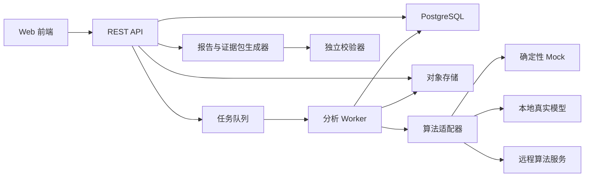
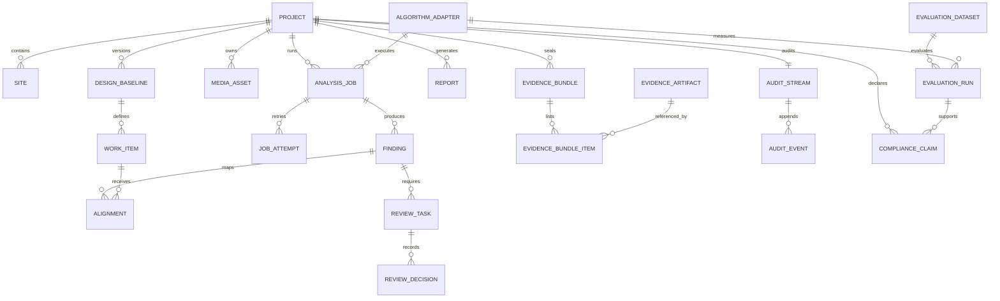
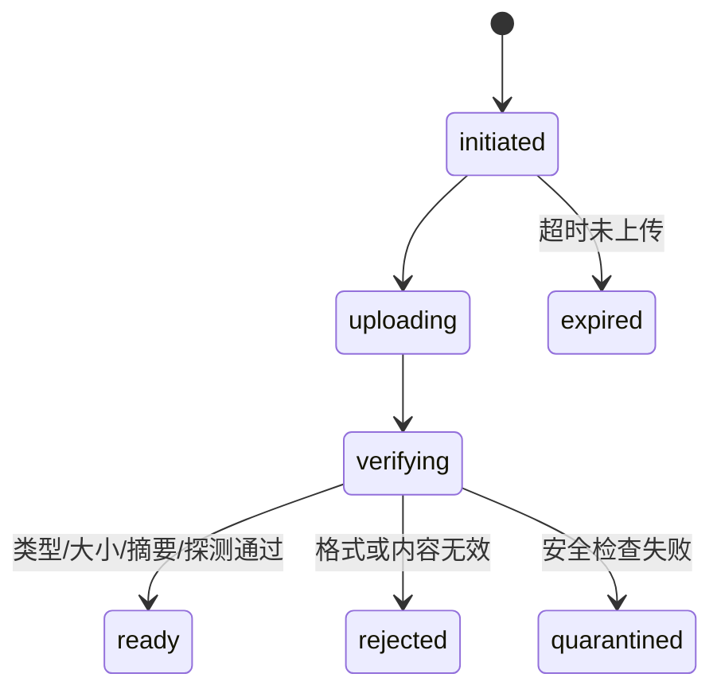
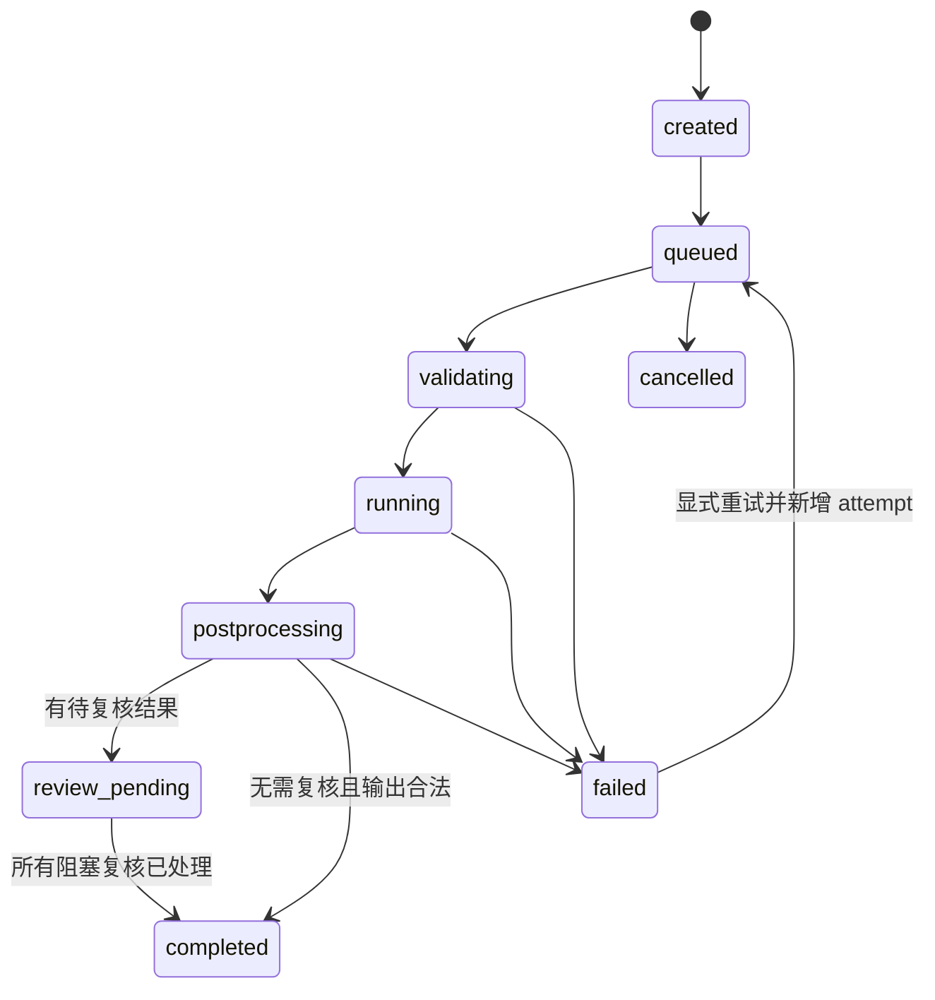
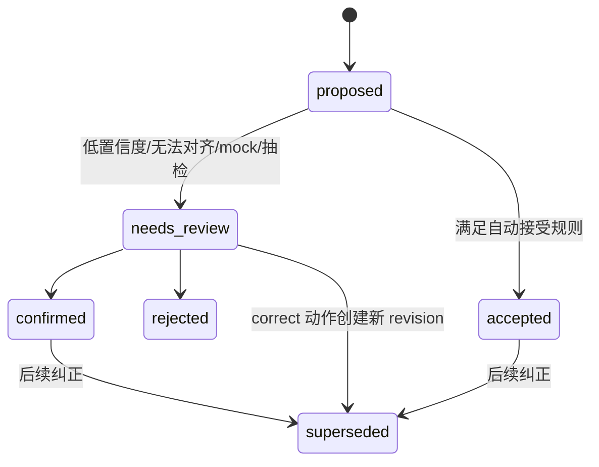
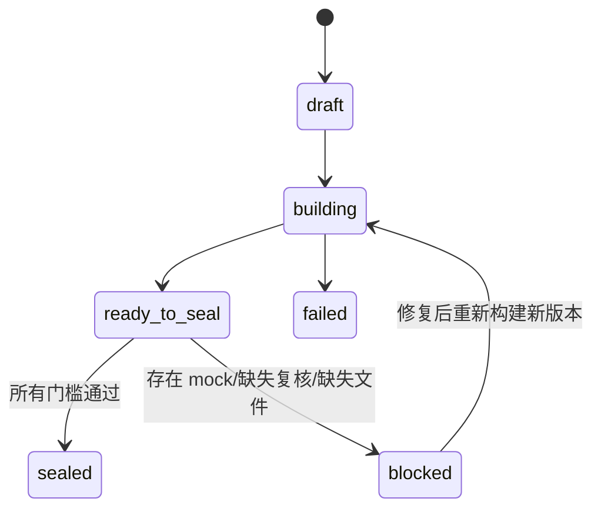

# 子赛题 5 后端优先、算法可插拔 MVP 技术设计

## 0. 设计结论

本 MVP 的目标不是在缺少正式数据集和模型时伪造一个“AI 已完成”的系统，而是先完成一条真实、可测试、可替换算法的工程链路：

`工程基线 -> 视频/影像入库 -> 异步分析任务 -> 结构化结果 -> 人工复核 -> 工程对象/进度对齐 -> 报告 -> 证据包 -> 哈希链校验`

本轮必须做到：

- 文件、任务、结构化结果、复核、报告和证据包都由真实后端持久化；
- mock 适配器只用于验证流程，输出必须确定性、可识别、带水印，并被禁止用于正式指标和提交级证据包；
- 正式算法以后只替换适配器，不改业务状态机、API、证据结构和验收测试；
- 系统只陈述已经验证的能力。例如上传视频后的批处理不能表述为“实时视频监管”，手工绑定设计对象不能表述为“自动动态对齐”，本地哈希不能表述为“区块链司法存证”。

## 1. MVP 假设、目标和非目标

### 1.1 当前假设

1. 当前阶段已有或即将有前端，但算法数据集和正式模型尚未确定。
2. MVP 首先支持视频/图片上传，不在本轮实现摄像头直播流。
3. 每条媒体数据必须绑定项目、工点和设计/计划基线，避免退化为通用视频检测。
4. 算法可能是本地 Python、独立容器或远程服务，因此业务层不能直接依赖某个模型框架。
5. 本轮使用本地或自建对象存储，不依赖特定云厂商。
6. 赛题的 85%/90% 指标只能由固定、带真值的数据集和评估运行产生，不能由演示样例推断。

### 1.2 MVP 要证明什么

- 一段真实文件能被完整接收、校验、保存和追踪；
- 一个分析任务能可靠排队、运行、失败、重试和完成；
- 任意算法只要实现统一契约，就能输出统一的结构化结果；
- 低置信度、无法对齐和算法异常不会被包装成成功结论；
- 人工复核会产生新版本和审计记录，不会静默覆盖原始输出；
- 报告和证据包可以从数据库与对象存储重新生成；
- 证据包任一内容被修改后，校验器能够指出具体失败项；
- mock 和真实算法在数据、界面、报告、API 和证据包中始终可区分。

### 1.3 本轮非目标

- 不承诺违章识别准确率 ≥85% 或隐蔽工程结构化准确率 ≥90%；
- 不承诺直播流、秒级实时延迟或多路摄像头并发；
- 不承诺已经接通真实 IoT 设备、传感器或 QGIS；
- 不承诺自动完成设计模型空间配准；
- 不承诺区块链、司法效力或可信时间戳；
- 不承诺生产级高可用、异地容灾和大规模 GPU 调度；
- 不用随机数或写死的“高置信度结果”伪装正式模型。

## 2. 参考架构

若现有 demo 已有稳定技术栈，可以保留原栈，但下面的领域契约和状态机不应被破坏。一个适合当前阶段的参考实现是：

- API：FastAPI + Pydantic，自动生成 OpenAPI；
- 数据库：PostgreSQL + SQLAlchemy + Alembic；
- 任务队列：Redis + Dramatiq、RQ 或 Celery 三选一；任务事实状态始终保存在 PostgreSQL；
- 对象存储：开发期使用本地目录实现 `ObjectStore` 接口，演示/部署使用 MinIO 或 S3 兼容存储；
- 工作进程：独立 worker，不在 HTTP 请求内执行视频处理；
- 报告：结构化 JSON 为源，Jinja2 生成 HTML；PDF 导出可后续增加；
- 校验器：独立 CLI 和后端 API 共用同一验证库；
- 部署：Docker Compose 启动 API、worker、PostgreSQL、Redis 和 MinIO。



关键隔离原则：算法适配器不得直接写业务数据库。它只能读取已授权输入并返回符合版本化 schema 的结果；业务 worker 负责校验 schema、落库、审计和状态迁移。

## 3. 领域实体

所有主键建议使用 UUIDv7；所有时间以 UTC 保存并以带时区 ISO 8601 输出。证据相关记录不做物理覆盖，修改通过新版本或纠正事件表达。

### 3.1 核心实体

| 实体 | 关键字段 | 不变量/说明 |
|---|---|---|
| `Project` | `id, code, name, status, owner_id, created_at` | 所有设计、媒体、任务和证据都必须属于项目 |
| `Site` | `id, project_id, code, name, location, metadata` | 表示工点/区域；位置可以先是 JSON，后续换 PostGIS |
| `DesignBaseline` | `id, project_id, version, source_artifact_id, content_sha256, status` | `published` 后内容不可改；变更要发布新版本 |
| `WorkItem` | `id, baseline_id, external_ref, type, name, site_id, planned_start, planned_end, expected_evidence` | 表示设计对象、工序或里程碑，是检测结果对齐的工程语义锚点 |
| `MediaAsset` | `id, project_id, site_id, object_key, mime_type, size_bytes, sha256, captured_at, source_type, status, metadata` | 原始文件不可原位替换；重复上传可按摘要去重但保留业务引用 |
| `AlgorithmAdapter` | `id, name, contract_version, mode, version, capabilities, code_digest, model_digest, config_digest, enabled` | `mode` 为 `mock/baseline/model/remote`；名称不能代表已达标 |
| `AnalysisJob` | `id, project_id, baseline_id, adapter_id, task_type, status, input_digest, progress, current_attempt, error_code, heartbeat_at` | 一次任务固定输入、基线和算法版本，重试不能偷偷换模型 |
| `JobAttempt` | `id, job_id, attempt_no, status, started_at, finished_at, worker_id, error_code, error_detail` | 每次重试单独记录，保留失败证据 |
| `Finding` | `id, job_id, media_id, revision, type, label, start_ms, end_ms, confidence, payload, evidence_refs, status, supersedes_id` | 原始算法结果不可覆盖；人工纠正生成新 revision |
| `Alignment` | `id, finding_id, work_item_id, method, score, relation, status, reason` | `method=automatic/manual`；手工绑定必须明确标注 |
| `ReviewTask` | `id, finding_id, reason_code, status, assignee_id, due_at` | 低置信度、无法对齐、mock 结果等进入复核 |
| `ReviewDecision` | `id, review_task_id, action, reviewer_id, reason, corrected_payload, created_at` | `confirm/reject/correct`；决定不可静默修改 |
| `ProgressSnapshot` | `id, project_id, baseline_id, work_item_id, status, percent, evidence_finding_ids, calculated_by, captured_at` | 算法推断和人工确认要区分 |
| `Report` | `id, project_id, template_version, source_snapshot, status, json_artifact_id, html_artifact_id, approved_by` | 报告引用冻结的结果版本，不直接读“当前最新值” |
| `EvidenceArtifact` | `id, project_id, object_key, media_type, size_bytes, sha256, source_entity_type, source_entity_id` | 证据对象按内容摘要校验，不原位覆盖 |
| `EvidenceBundle` | `id, project_id, purpose, status, manifest_artifact_id, seal_artifact_id, bundle_sha256, created_by, sealed_at` | `purpose=demo/validation/submission` 决定封装门槛 |
| `EvidenceBundleItem` | `bundle_id, artifact_id, logical_path, included, ordinal` | bundle 与 artifact 的版本化关联；同一内容可被多个包引用，封存后不变 |
| `AuditStream` | `project_id, next_sequence, head_hash` | 每项目一条追加式哈希链，更新时行锁防止分叉 |
| `AuditEvent` | `project_id, sequence, event_type, actor, entity_ref, payload_sha256, prev_hash, event_hash, occurred_at` | 只能追加，不能更新或删除 |
| `EvaluationDataset` | `id, name, version, task_type, ground_truth_artifact_id, split_digest, status` | 发布后冻结，必须能说明样本和真值口径 |
| `EvaluationRun` | `id, dataset_id, adapter_id, metric_spec_version, status, metrics, case_results_artifact_id` | mock 禁止创建正式评估结果；每个指标可回溯到样本 |
| `ComplianceClaim` | `id, project_id, claim_type, required_threshold, evaluation_run_id, status` | 将“违章识别 ≥85%”或“隐蔽工程结构化 ≥90%”绑定到唯一评估运行；不能手填通过 |

### 3.2 重要关系



## 4. 状态机

### 4.1 媒体状态



只有 `ready` 媒体可以进入分析。上传后重新计算服务端 SHA-256，不能信任客户端上报摘要。

### 4.2 分析任务状态



约束：

- `failed` 表示系统或算法执行失败，不表示“没有发现问题”。
- 低置信度、无法对齐、模型表示不确定属于业务结果，应进入 `review_pending`，而不是伪装成任务失败或成功。
- worker 每隔固定时间写 heartbeat；超过阈值的 `running` 任务由恢复器标记为 `WORKER_LOST`，再按策略重试。
- 同一 `Idempotency-Key` 和相同输入摘要重复创建任务时返回原任务，不重复推理。
- 重试固定 adapter、模型、配置和输入；若要换模型，必须新建任务。

### 4.3 结果和复核状态



`correct` 是 ReviewDecision 动作，不是最终 Finding 状态：旧 revision 进入 `superseded`，新 revision 根据规则进入 `confirmed` 或再次 `needs_review`。

本轮默认采用保守策略：

- 所有 mock 输出必须复核，且即使复核通过也只能进入 `demo` 证据包；
- 真实算法低于任务配置阈值的结果必须复核；
- 自动对齐失败必须复核；
- 可配置抽检比例，正式提交前可设为 100%。

### 4.4 证据包状态



`sealed` 后证据包不可原位修改。任何补充产生新 bundle version，旧版本保留。

## 5. 算法插件契约

### 5.1 统一接口

伪接口如下，具体实现可为 Python protocol、容器命令或 HTTP：

```python
class AlgorithmAdapter(Protocol):
    def describe(self) -> AdapterDescriptor: ...
    def healthcheck(self) -> HealthStatus: ...
    def analyze(self, request: AnalysisRequest) -> AnalysisResult: ...
```

`AnalysisRequest` 至少包含：

- `contract_version`；
- `job_id`、`task_type`；
- 只读媒体 URI、媒体 SHA-256、时长、帧率等；
- 项目/工点标识；
- 已发布设计基线和允许访问的工作项快照；
- 任务配置和随机种子；
- 输出目录或上传凭证；
- 截止时间和资源约束。

`AnalysisResult` 至少包含：

- `contract_version`、`job_id`；
- `adapter_id/version/mode`；
- `code_digest/model_digest/config_digest`；
- `started_at/completed_at`；
- `findings[]`：类型、标签、时间范围、置信度、bbox/区域、结构化字段、证据帧引用；
- `alignment_candidates[]`：候选工作项、关系、分数和理由；
- `progress_candidates[]`；
- `warnings[]` 和 `limitations[]`；
- 生成文件的路径、大小和摘要；
- 运行环境摘要，可记录容器 image digest、设备和依赖锁文件摘要。

业务层必须对返回值做 JSON Schema 校验、路径安全校验和摘要复算。adapter 返回“成功”不等于业务任务自动成功。

### 5.2 四种模式的诚实边界

| 模式 | 允许做什么 | 不允许声称什么 |
|---|---|---|
| `mock` | 用固定 fixture 生成确定性结果，测试队列、页面、复核、报告、存证 | 不得参与正式评估，不得用于 `submission` 包，不得声称实际识别 |
| `baseline` | 执行真实规则或传统算法，结果可复现，可进入评估 | 未达到固定测试集阈值前不得声称达标 |
| `model` | 执行真实训练模型或推理模型 | `mode=model` 不等于准确，也不等于已通过赛题验收 |
| `remote` | 调用外部算法服务，保存服务版本和请求/响应摘要 | 不得隐藏服务版本、失败、超时或数据外发风险 |

### 5.3 Mock 适配器规则

1. 只支持仓库内明确登记的 fixture 输入；未知输入返回 `MOCK_FIXTURE_NOT_FOUND`，不能随机产生“看起来合理”的结果。
2. 结果中固定包含：
   - `mode: "mock"`；
   - `evidence_grade: false`；
   - `limitations: ["流程演示数据，非真实算法输出"]`。
3. API、前端、报告和 manifest 均显示 `MOCK/演示数据`。
4. 任何试图用 mock 创建正式评估运行或 `purpose=submission` 证据包的请求返回 409。
5. 可以同时提供一个真实的 `media-probe-v1` 基线适配器，用 ffprobe/等价工具提取时长、帧率、关键帧等。它证明媒体确实被处理，但不能被称为违章识别或隐蔽工程验真算法。

## 6. REST API

统一前缀为 `/api/v1`。写操作支持 `Idempotency-Key`；错误响应统一包含 `code, message, retryable, details, trace_id`。所有资源返回 `created_at, updated_at, version`。

### 6.1 系统和算法能力

| 方法 | 路径 | 用途 |
|---|---|---|
| GET | `/healthz` | 进程存活，不检查外部依赖 |
| GET | `/readyz` | 检查数据库、对象存储、队列 |
| GET | `/algorithms` | 列出 adapter、模式、版本、能力和健康状态 |
| GET | `/algorithms/{adapter_id}` | 查看模型/代码/配置摘要和限制 |

### 6.2 项目、工点和基线

| 方法 | 路径 | 用途 |
|---|---|---|
| POST | `/projects` | 新建项目 |
| GET | `/projects` | 分页查询项目 |
| GET | `/projects/{project_id}` | 项目详情 |
| POST | `/projects/{project_id}/sites` | 新建工点 |
| POST | `/projects/{project_id}/baselines` | 创建基线草稿并上传源文件 |
| POST | `/baselines/{baseline_id}/work-items:import` | 导入工序/设施/里程碑 |
| POST | `/baselines/{baseline_id}:publish` | 冻结基线并计算内容摘要 |
| GET | `/baselines/{baseline_id}` | 基线详情及内容摘要 |

### 6.3 媒体

| 方法 | 路径 | 用途 |
|---|---|---|
| POST | `/projects/{project_id}/media` | MVP 使用 multipart 上传视频/图片及元数据 |
| POST | `/projects/{project_id}/media:initiate` | 大文件预签名上传，后续实现 |
| POST | `/media/{media_id}:complete` | 服务端校验对象、大小和 SHA-256 |
| GET | `/media/{media_id}` | 获取状态、元数据和摘要 |
| GET | `/media/{media_id}/content` | 鉴权下载或短期签名 URL |

### 6.4 分析任务和结果

| 方法 | 路径 | 用途 |
|---|---|---|
| POST | `/analysis-jobs` | 创建任务，固定媒体、基线、adapter 和配置 |
| GET | `/analysis-jobs/{job_id}` | 查询状态、进度、attempt、错误和算法来源 |
| POST | `/analysis-jobs/{job_id}:cancel` | 取消尚未完成的任务 |
| POST | `/analysis-jobs/{job_id}:retry` | 按原输入创建新 attempt |
| GET | `/analysis-jobs/{job_id}/findings` | 分页返回结构化结果 |
| GET | `/findings/{finding_id}` | 返回证据帧、版本、对齐和复核状态 |
| GET | `/projects/{project_id}/progress` | 获取有证据引用的进度快照 |

创建任务请求示例：

```json
{
  "project_id": "019...",
  "baseline_id": "019...",
  "media_ids": ["019..."],
  "task_type": "hidden_work_structuring",
  "adapter_id": "fixture-demo-v1",
  "config": {
    "review_confidence_threshold": "0.85"
  }
}
```

响应必须显式返回：

```json
{
  "id": "019...",
  "status": "queued",
  "algorithm": {
    "adapter_id": "fixture-demo-v1",
    "mode": "mock",
    "version": "1.0.0"
  },
  "evidence_grade": false,
  "warnings": ["该任务使用演示 Mock，不代表真实算法输出"]
}
```

### 6.5 复核和纠正

| 方法 | 路径 | 用途 |
|---|---|---|
| GET | `/review-tasks?project_id=&status=` | 获取复核队列 |
| POST | `/review-tasks/{review_id}/decisions` | `confirm/reject/correct`，必须提交原因 |
| GET | `/findings/{finding_id}/revisions` | 查看原始结果和所有纠正版本 |
| POST | `/alignments/{alignment_id}:confirm` | 确认自动对齐 |
| POST | `/findings/{finding_id}/alignments` | 人工绑定工作项并标记 `method=manual` |

纠正不能 PATCH 覆盖原 finding。`correct` 会创建新 revision，并将旧版本标记为 `superseded`。

### 6.6 报告、证据包和校验

| 方法 | 路径 | 用途 |
|---|---|---|
| POST | `/projects/{project_id}/reports` | 基于冻结结果快照生成报告 |
| GET | `/reports/{report_id}` | 查看状态、模板版本和来源快照 |
| GET | `/reports/{report_id}/content` | 下载 JSON/HTML 报告 |
| POST | `/projects/{project_id}/evidence-bundles` | 创建 `demo/validation/submission` 包 |
| POST | `/evidence-bundles/{bundle_id}:build` | 构建 manifest、audit 和对象清单 |
| POST | `/evidence-bundles/{bundle_id}:seal` | 运行门槛检查并封存 |
| GET | `/evidence-bundles/{bundle_id}/download` | 下载 ZIP 或分卷包 |
| POST | `/evidence-bundles:verify` | 上传证据包并返回逐项校验结果 |
| GET | `/projects/{project_id}/audit-events` | 审计查看，普通用户不可修改 |

### 6.7 数据集和正式评估

| 方法 | 路径 | 用途 |
|---|---|---|
| POST | `/evaluation-datasets` | 创建数据集草稿 |
| POST | `/evaluation-datasets/{id}:publish` | 冻结样本、真值、划分和指标口径 |
| POST | `/evaluation-runs` | 在冻结数据集上运行非 mock adapter |
| GET | `/evaluation-runs/{id}` | 指标、样本量、失败项和来源摘要 |
| GET | `/evaluation-runs/{id}/cases` | 从汇总指标回溯到每个样本 |
| POST | `/projects/{project_id}/compliance-claims` | 选择赛题指标路径并绑定 EvaluationRun |
| GET | `/projects/{project_id}/compliance-claims` | 查看阈值、评估来源和是否验证通过 |

冻结的 metric spec 至少包含：任务类型、样本单元（帧/片段/事件/字段）、类别和字段定义、忽略规则、TP/FP/TN/FN 或字段匹配规则、聚合方式、样本量、阈值、脚本版本和输出 schema。修改任一口径必须发布新版本，不能覆盖已有 EvaluationRun。

### 6.8 最小身份和权限

MVP 不需要先做企业单点登录，但审计和复核不能依赖前端自报用户名。可先使用本地账号 + JWT，并固定四种角色：

| 角色 | 最小权限 |
|---|---|
| `admin` | 管理项目成员、adapter 开关和系统配置 |
| `operator` | 上传媒体、创建任务、查看结果、发起报告/证据包 |
| `reviewer` | 复核/纠正 finding、确认对齐、批准报告 |
| `auditor` | 只读查看审计和运行独立校验，不能修改业务结果 |

- actor 必须从已验证身份注入审计事件，接口请求体不得覆盖 actor。
- 报告批准和 submission 封存至少要求 `reviewer` 或 `admin`。
- 建议禁止操作者批准自己产生的最终报告；若 MVP 暂不做职责分离，报告中必须说明限制。
- JWT 密钥、Ed25519 私钥和对象存储凭据不得进入仓库、manifest 或报告。

## 7. 失败、重试和复核语义

### 7.1 错误分类

| 错误码 | 含义 | 是否自动重试 |
|---|---|---|
| `MEDIA_UNSUPPORTED` | 媒体类型或编码不支持 | 否 |
| `MEDIA_HASH_MISMATCH` | 上传对象与声明摘要不一致 | 否，需重新上传 |
| `MEDIA_CORRUPTED` | ffprobe/解码失败 | 否 |
| `BASELINE_NOT_PUBLISHED` | 使用了未冻结基线 | 否 |
| `BASELINE_OBJECT_NOT_FOUND` | 无法找到可对齐工程对象 | 不作为系统失败，转复核 |
| `PLUGIN_UNAVAILABLE` | adapter 不健康或无法连接 | 是，指数退避 |
| `PLUGIN_TIMEOUT` | 超过任务时限 | 视任务策略有限重试 |
| `PLUGIN_OUTPUT_INVALID` | 输出不符合 schema | 否，算法缺陷 |
| `WORKER_LOST` | worker 心跳丢失 | 是，新增 attempt |
| `OBJECT_STORE_UNAVAILABLE` | 对象存储暂时不可用 | 是 |
| `REPORT_RENDER_FAILED` | 报告生成失败 | 是，固定输入重试 |
| `EVIDENCE_ARTIFACT_MISSING` | 证据对象不存在 | 否，阻止封存 |
| `HASH_VERIFICATION_FAILED` | 摘要或哈希链不一致 | 否，明确报告被篡改项 |
| `MOCK_NOT_ALLOWED` | mock 试图进入正式评估/提交包 | 否 |

### 7.2 不确定性不是系统错误

以下情况进入复核，而不是返回一个虚假的确定结论：

- `confidence < review_threshold`；
- 模型输出“unknown/无法判断”；
- 有多个相近的设计对象候选；
- 视频时间、工点或拍摄信息缺失；
- 结构化字段不完整；
- 规则和模型结论冲突；
- 抽检命中；
- 所有 mock 输出。

### 7.3 并发和一致性

- 写接口带数据库事务和乐观版本号；冲突返回 409。
- 队列消息只携带 job ID，worker 每次从数据库读取固定输入。
- 创建任务和投递队列之间使用 transactional outbox 或数据库任务分发器，避免“数据库已创建但消息丢失”。
- worker 写结果时先落临时对象，摘要校验成功后再原子提交数据库状态。
- 同一 finding 的复核任务用唯一约束防重复；重复决定由幂等键返回原结果。

## 8. 证据包目录和 manifest

### 8.1 推荐目录

```text
evidence-bundle/
  manifest.json
  seal.json
  audit.ndjson
  source/
    media/<media-id>.<ext>
    baseline/<baseline-id>.<ext>
  derived/
    findings.json
    alignments.json
    progress.json
    evidence-frames/
  review/
    decisions.json
  reports/
    report.json
    report.html
  evaluation/
    metric-spec.json
    metrics.json
    case-results.json
```

大视频可以放入伴随数据分卷，但 `manifest.json` 仍必须记录其摘要、大小、分卷和获取方式。独立校验若拿不到原始字节，只能给出 `NOT_AVAILABLE`，不能声称完整通过。

### 8.2 `manifest.json` 示例

`manifest.json` 是被哈希的核心清单，不包含自己的摘要，也不包含 `seal.json`，避免循环依赖。

```json
{
  "schema_version": "1.0",
  "bundle_id": "019...",
  "bundle_version": 1,
  "purpose": "demo",
  "created_at": "2026-07-10T12:00:00Z",
  "project": {
    "id": "019...",
    "code": "DEMO-001"
  },
  "baseline": {
    "id": "019...",
    "version": 1,
    "content_sha256": "...",
    "status": "published"
  },
  "analysis": [
    {
      "job_id": "019...",
      "task_type": "hidden_work_structuring",
      "adapter_id": "fixture-demo-v1",
      "adapter_mode": "mock",
      "adapter_version": "1.0.0",
      "code_digest": "sha256:...",
      "model_digest": null,
      "config_digest": "sha256:...",
      "evidence_grade": false
    }
  ],
  "review": {
    "required_count": 3,
    "completed_count": 3,
    "blocking_open_count": 0
  },
  "claims": {
    "realtime_tracking": false,
    "multi_source_live_ingestion": false,
    "accuracy_threshold_verified": false,
    "compliance_claim_id": null,
    "evaluation_run_id": null,
    "integrity_verifiable_export": true,
    "legal_timestamp": false
  },
  "artifacts": [
    {
      "logical_path": "source/media/019.mp4",
      "media_type": "video/mp4",
      "size_bytes": 123456,
      "sha256": "...",
      "source_entity": "MediaAsset:019...",
      "included": true
    },
    {
      "logical_path": "reports/report.json",
      "media_type": "application/json",
      "size_bytes": 2345,
      "sha256": "...",
      "source_entity": "Report:019...",
      "included": true
    }
  ],
  "audit_chain": {
    "algorithm": "sha256",
    "genesis_hash": "0000000000000000000000000000000000000000000000000000000000000000",
    "head_hash": "...",
    "event_count": 24,
    "events_artifact": "audit.ndjson",
    "events_sha256": "..."
  }
}
```

要求：

- `artifacts` 按 `logical_path` 字典序排序；路径不得绝对化、包含 `..` 或符号链接跳转；
- JSON 摘要使用 RFC 8785 JSON Canonicalization Scheme，或项目明确实现并测试等价的确定性规范；
- 浮点置信度建议以十进制定点字符串保存，避免跨语言序列化差异；
- manifest 不能包含密钥、访问令牌或未脱敏个人信息；
- `claims` 必须由系统事实生成，不能由前端自由勾选。

### 8.3 `seal.json`

```json
{
  "schema_version": "1.0",
  "manifest_canonicalization": "RFC8785",
  "manifest_sha256": "...",
  "sealed_at": "2026-07-10T12:01:00Z",
  "signing": {
    "algorithm": "ed25519",
    "key_id": "demo-server-key-1",
    "public_key_fingerprint": "...",
    "signature": "base64..."
  },
  "transport": {
    "bundle_sha256": null,
    "note": "ZIP 摘要在打包完成后由下载响应或伴随 .sha256 文件提供"
  }
}
```

MVP 可以先只做 SHA-256，再加入 Ed25519 签名。若使用本地服务器私钥，只能声称“由该服务器密钥签名”；没有外部可信时间戳时，`sealed_at` 不是司法级可信时间。私钥必须来自环境密钥或挂载文件，并具有稳定 `key_id` 和可导出的公钥；不能在代码仓库中生成并提交固定私钥。

签名消息必须有唯一规范：对 `seal.json` 中除 `signature` 和 `transport` 外的字段按 RFC 8785 规范化后签名，使 `manifest_sha256`、`sealed_at`、算法、`key_id` 和公钥指纹都受保护。独立 CLI 应要求 `--trusted-public-key` 或受信 key registry；仅使用证据包自带公钥可以验证数学一致性，但不能证明签名者身份可信。

## 9. 哈希链设计和校验

### 9.1 审计事件链

每个项目维护单一追加式审计流。事件 payload 不包含 `prev_hash/event_hash`，规范化后计算：

```text
event_hash = SHA256(
  UTF8(prev_hash) || 0x0A || RFC8785(event_payload)
)
```

第一个事件的 `prev_hash` 为 64 个 `0`。写入事件时在同一数据库事务内锁定 `AuditStream` 行，读取 head、分配 sequence、计算新 hash、追加事件并更新 head，防止并发分叉。

建议事件类型：

- `PROJECT_CREATED`；
- `BASELINE_PUBLISHED`；
- `MEDIA_ACCEPTED`；
- `ANALYSIS_STARTED/COMPLETED/FAILED`；
- `FINDING_CREATED`；
- `REVIEW_CONFIRMED/REJECTED/CORRECTED`；
- `REPORT_GENERATED/APPROVED`；
- `BUNDLE_PREPARED`。

`BUNDLE_PREPARED` 是导出链的最后事件，随后生成 manifest 和 seal。服务器数据库可以另外追加 `BUNDLE_SEALED`，引用 `manifest_sha256`；该事件不回填当前包，避免形成循环依赖。

MVP 的 `audit.ndjson` 应导出该项目从 genesis 到 `BUNDLE_PREPARED` 的完整连续事件链，而不是只筛选“看起来相关”的事件。否则独立校验器无法证明中间事件没有被删除。项目规模增大后再设计签名 checkpoint、Merkle inclusion proof 或分段归档，本轮不提前伪造这类能力。

### 9.2 独立校验步骤

校验器按顺序执行：

1. 防御性解包：限制文件数、总大小、压缩比，拒绝绝对路径、`..`、符号链接和重复路径。
2. 校验 `manifest.json` 和 `seal.json` schema。
3. 规范化 manifest 并计算 SHA-256，与 seal 中摘要比较。
4. 若有签名，使用内置或指定公钥验证 Ed25519 签名。
5. 对每个 included artifact 检查存在性、文件大小和 SHA-256。
6. 校验 `audit.ndjson` 自身摘要。
7. 从 genesis 开始逐条重算 sequence、`prev_hash` 和 `event_hash`，比对 manifest 的 head 和 event count。
8. 校验业务约束：基线已发布、任务版本完整、复核无阻塞项、报告引用的 finding revision 存在。
9. 根据 `purpose` 检查门槛：
   - `demo` 可以包含 mock，但必须有水印和 `evidence_grade=false`；
   - `validation` 不允许 mock，必须引用固定 EvaluationRun；
   - `submission` 不允许 mock、待复核项、缺失原始证据或未通过的指标声明。
10. 输出逐项结果和总 verdict：`VALID/INVALID/PARTIAL/UNSUPPORTED`。

### 9.3 哈希链能证明和不能证明什么

能证明：拿到的文件集合与封存时清单是否一致；审计事件是否被插入、删除、重排或修改；签名是否来自指定服务器密钥。

不能单独证明：视频内容本身真实、模型判断正确、拍摄时间可信、管理员在封存前没有造假，或服务器私钥没有泄露。若后续需要更强保证，应将 manifest 摘要定期锚定到独立时间戳服务、第三方存证平台或独立保管介质。本轮不得把本地哈希链宣传为区块链或司法存证。

## 10. 证据包封存门槛

### 10.1 `demo`

- 允许 mock；
- 所有 mock 结果带水印；
- `claims.accuracy_threshold_verified=false`；
- 报告标题明确写“流程演示，不代表真实算法效果”。

### 10.2 `validation`

- adapter 不能是 mock；
- 数据集和真值已发布冻结；
- EvaluationRun 成功且样本级结果可追溯；
- 指标口径、模型/代码/配置摘要齐全；
- 所有失败样本保留，不得只导出成功结果。

### 10.3 `submission`

- 满足 validation 全部条件；
- 所有媒体和基线摘要完整；
- 所有阻塞复核关闭；
- 报告已经指定角色批准；
- 所有算法输出均能回链到原始媒体时间点/证据帧；
- 至少有 1 条 verified ComplianceClaim：违章识别评估达到 85%，或隐蔽工程影像结构化评估达到 90%，并绑定对应 EvaluationRun；
- manifest、audit、artifact、签名校验全部通过。

## 11. 端到端验收测试

以下是设计级验收清单，不代表当前已经执行通过。实现后应转成 API 集成测试、worker 测试和校验器测试。

| 编号 | 场景 | 操作 | 通过条件 |
|---|---|---|---|
| E2E-01 | 发布工程基线 | 创建项目、导入工作项、发布基线 | 生成内容摘要；发布后修改返回 409；新版本可发布 |
| E2E-02 | 真实媒体上传 | 上传有效 MP4 | 服务端复算 SHA-256；ffprobe 信息落库；状态为 `ready` |
| E2E-03 | 损坏媒体 | 上传扩展名为 mp4 的随机字节 | 状态 `rejected`，错误为 `MEDIA_CORRUPTED`，不能创建分析任务 |
| E2E-04 | 上传幂等 | 相同幂等键重复提交 | 不重复创建对象；返回同一资源 |
| E2E-05 | Mock 流程 | 对登记 fixture 运行 mock | 结果确定性相同；API/报告/manifest 均标记 mock |
| E2E-06 | Mock 边界 | 用 mock 创建 validation/submission 包 | 返回 409 `MOCK_NOT_ALLOWED` |
| E2E-07 | 未知 Mock 输入 | 对未登记视频运行 mock | 返回 `MOCK_FIXTURE_NOT_FOUND`，不生成随机结果 |
| E2E-08 | 真实处理证明 | 运行 `media-probe-v1` | 输出真实时长/帧率/关键帧；不出现违章或验真准确率声明 |
| E2E-09 | 插件 schema 失败 | fake adapter 返回缺字段或非法路径 | attempt 失败为 `PLUGIN_OUTPUT_INVALID`，无污染结果落库 |
| E2E-10 | Worker 崩溃恢复 | 运行中杀死 worker | 心跳超时，记录 `WORKER_LOST`，新 attempt 恢复，旧 attempt 保留 |
| E2E-11 | 低置信度复核 | adapter 返回低于阈值结果 | 任务进入 `review_pending`，不能直接进入 submission 包 |
| E2E-12 | 人工纠正 | reviewer 修正字段并填写原因 | 新 finding revision 生成，旧版本保留，审计链追加事件 |
| E2E-13 | 无法对齐 | finding 无匹配 work item | 生成复核任务；界面/API 明确为“未对齐”，不能计入自动进度 |
| E2E-14 | 报告冻结 | 生成报告后再纠正 finding | 旧报告保持原快照；必须显式生成新报告版本 |
| E2E-15 | 有效证据包 | 构建并校验未修改 demo 包 | 所有 artifact、manifest 和 audit 通过；verdict `VALID` |
| E2E-16 | 篡改原视频 | 修改包内 1 byte | 指出对应媒体 SHA-256 失败；verdict `INVALID` |
| E2E-17 | 篡改结果 JSON | 修改 finding 字段 | 指出 artifact SHA-256 失败；verdict `INVALID` |
| E2E-18 | 篡改审计链 | 删除/重排 audit 事件 | sequence、prev hash 或 head 校验失败 |
| E2E-19 | 缺失大文件 | manifest 声明 included 但删除文件 | verdict `INVALID`；不能降级为通过 |
| E2E-20 | 正式评估防伪 | 没有真值或 metric spec 时请求评估 | 请求失败；不生成 accuracy 数字 |
| E2E-21 | 指标可回溯 | 固定数据集运行真实 adapter | 汇总值可下钻到每个样本、真值、预测和公式 |
| E2E-22 | 阈值门槛 | 评估结果低于声明阈值 | submission 封存被阻止，不得手工改指标 JSON 绕过 |
| E2E-23 | 目录穿越 | 包含 `../x` 或符号链接的恶意 ZIP | 安全拒绝，不写出目标目录 |
| E2E-24 | 权限和审计 | 普通操作者尝试批准报告/删除审计 | 返回 403；失败操作也可记录安全日志 |

## 12. 本轮该做、只做接口和不该假装做的内容

### 12.1 本轮必须真实完成

1. PostgreSQL schema 和迁移；
2. 项目、工点、设计基线及工作项的最小 CRUD，并支持明确 schema 的 JSON/CSV 导入；原始 QGIS/CAD 文件可作为附件保存，但本轮不宣称已自动解析；
3. 真实媒体上传、服务器摘要、格式探测和对象存储；
4. 异步任务、attempt、心跳、失败和重试；
5. 版本化算法适配器契约；
6. 确定性 fixture mock，并强制水印和封存门槛；
7. 至少一个真实但不冒充目标算法的媒体探测 adapter；
8. finding、alignment、review 和 revision；
9. 基于冻结快照的 JSON/HTML 报告；
10. manifest、artifact SHA-256、项目审计哈希链、独立校验器；
11. demo 包和 submission 包不同门槛；
12. 上述关键 API 的集成测试与 E2E 测试；
13. 自动 OpenAPI 文档和一套可重复演示数据；
14. 最小 JWT 身份、`operator/reviewer/auditor/admin` 权限和真实 actor 审计。

### 12.2 本轮只保留接口或占位，不宣称已实现

- 真实违章检测模型 adapter；
- 隐蔽工程字段抽取模型 adapter；
- QGIS/CAD 的真实几何解析和自动空间配准；
- MQTT/IoT/传感器接入；
- RTSP/WebRTC 直播流；
- 外部时间戳、第三方存证或区块链锚定；
- GPU 多租户和大规模任务调度；
- 完整企业级权限、单点登录和审计合规。

占位接口必须返回 `NOT_IMPLEMENTED` 或明确 capability 为 false，不能返回伪成功。

### 12.3 不应该出现的宣传或界面文案

| 当前真实状态 | 禁止表述 | 可诚实表述 |
|---|---|---|
| 上传视频后离线处理 | “实时视频监管” | “视频批处理分析；直播接入待实现” |
| mock fixture 输出 | “AI 自动识别结果” | “流程演示数据/MOCK” |
| 手工绑定 work item | “自动与设计模型动态对齐” | “人工确认的工程对象关联” |
| 本地 SHA-256 | “区块链存证”“绝对不可篡改” | “可检测导出后内容篡改的完整性校验” |
| 没有固定测试集 | “准确率 90%” | “指标尚未验证，待数据集和评估口径确定” |
| 只有视频输入 | “多源感知已完成” | “当前支持视频输入，IoT/传感器适配接口预留” |
| 规则生成进度 | “施工进度自动实时跟踪” | “基于已确认事件生成的进度快照” |
| 报告由 mock 生成 | “可信竣工验真报告” | “演示报告，不作为工程验收结论” |

## 13. 建议实施顺序

### Slice 0：骨架和可观测性

- FastAPI、配置、数据库迁移、日志、trace ID、healthz/readyz；
- Docker Compose；
- 错误响应和幂等中间件。

### Slice 1：工程基线与真实文件

- Project/Site/Baseline/WorkItem；
- 先用版本化 JSON/CSV 表达工作项和里程碑，保存原始 CAD/QGIS 附件但不假装完成几何解析；
- 上传、对象存储、SHA-256、ffprobe；
- 基线发布后冻结。

### Slice 2：任务和插件

- AnalysisJob/Attempt、队列、worker 心跳和恢复；
- adapter schema；
- fixture mock 和 media probe；
- 任务查询和进度。

### Slice 3：结构化结果和复核

- Finding/Alignment/Review；
- 低置信度和无法对齐状态；
- revision 和审计事件。

### Slice 4：报告和证据包

- 冻结结果快照；
- JSON/HTML 报告；
- manifest、audit.ndjson、seal、ZIP 和校验器；
- demo/submission 门槛。

### Slice 5：评估和正式算法接入点

- EvaluationDataset/Run；
- metric spec 和样本级结果；
- 用假的 adapter 测错误路径，用真实 baseline 测执行路径；
- 正式模型就绪后，只新增 adapter 和指标配置。

## 14. MVP 完成定义

只有同时满足以下条件，才能说“后端 MVP 完成”：

- 全新环境可用一条命令启动依赖和服务；
- 数据库迁移从空库成功执行；
- OpenAPI 中列出的 MVP 接口可调用；
- 一个真实 MP4 能完成上传、摘要、探测、任务、mock 分析、复核、报告、证据包和独立校验；
- mock 在所有输出中均有显著标识，且无法进入正式评估和提交级证据包；
- 杀死 worker 后任务能以新 attempt 恢复或明确失败；
- 修改任一证据文件会导致校验失败并定位到对象；
- 所有 E2E 用例有自动化结果，未实现项明确 skip 并说明原因，不能用空断言冒充通过；
- 文档明确说明当前没有正式算法指标，直到固定数据集、真值、口径和真实 adapter 全部具备。

这一定义让前端可以立即围绕真实 API 开发，也让算法团队以后独立迭代，同时避免在比赛材料中把尚未实现或尚未验证的能力写成既成事实。
